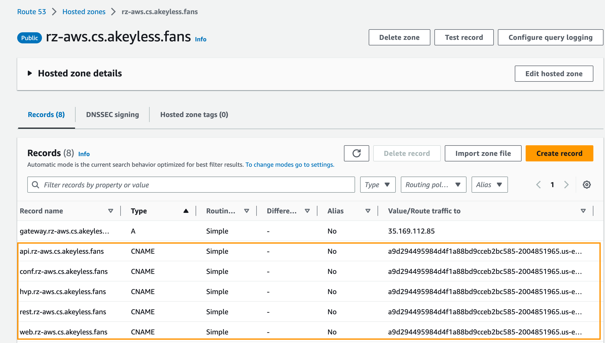

# Deploy an Akeyless Gateway on EKS

This repo is built on top of the [Provision an EKS Cluster tutorial](https://developer.hashicorp.com/terraform/tutorials/kubernetes/eks), containing
Terraform configuration files to provision an EKS cluster on AWS.

## 1. Prerequisites
- Clone this repo onto your local machine
```
git clone https://github.com/roseakeyless/akeyless-gateway-eks.git
```
- Have terraform cli installed locally. Follow this [guide](https://developer.hashicorp.com/terraform/tutorials/aws-get-started/install-cli) to install terraform if needed
```
https://developer.hashicorp.com/terraform/tutorials/aws-get-started/install-cli
```

- Update the access_key and secret_key in the terraform.tfvars.example file and remove .example from the file extension. These are the credentials that terraform uses for authenticating to AWS. Alternatively, you can also use environment variables for authentication.
```
export AWS_ACCESS_KEY_ID="access_key"
export AWS_SECRET_ACCESS_KEY="secret_key"
export AWS_REGION="us-east-1"
```

- Update the variables.tf file to reflect the region and variable values you would like to use

- Update the terraform.tf file to specify where the state file will be stored. Remove the cloud block if the state file is stored on the local machine
```
  terraform {
  cloud {
    organization = "dcatcher-learning"

    workspaces {
      name = "akeyless-eks-demo"
    }
  }
```
- Run Terraform to create the resources
```
terraform init    #to initilize terraform in the directory

terraform plan    #to preview the resources

terraform apply   #to create the resources
```

## 2. Set up Akeyless Gateway with Nginx Ingress and Cert Manager on the EKS cluster
- Run the following cli locally to get the EKS cluster access credentials
```
aws eks --region $(terraform output -raw region) update-kubeconfig \
    --name $(terraform output -raw cluster_name)

```

- Once the EKS cluster is up and running, follow this [guide](https://gist.github.com/devorbitus/a292aa1bed559c9b87053aa0fe21d094) to set up Akeyless Gateway with Nginx Ingress and Cert Manager
```
https://gist.github.com/devorbitus/a292aa1bed559c9b87053aa0fe21d094
```

- Add DNS records to your hosted zone in AWS Route 53 with CNAME records pointing to the Nginx Ingress External IP/DNS Name
  - run the following k8s cli to get the external IP/DNS name for the Nginx Ingress load balancer
     ```
     kubectl get svc -n akeyless
     ```
  

